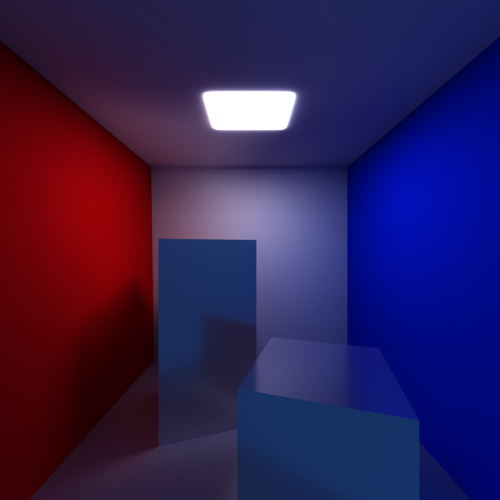

# Pathtracer Benchmark

A benchmark of a custom offiline pathtracer comparing SAH-BVH and Havran SAH-KdTree as well as Vulkan SPIR-V and CUDA API

## Milestones

### Pathtracer
🟩 **Base Pathtracer**
- Rendering
- Mathmatically and Physically Accurate
- Handles Benchmark
    - Acc Framebuffer
    - Tree Stats buffer

🟩 **Modularized**
- Acceleration Structure
- API
- Scenes
- Resolution
- Light Bounces
- Tile Size
- Benchmark type
    - SPP
    - IMGREF

🟩 **Vulkan SPIR-V**

🟩 **SAH-BVH**

🟩 **SAH-KdTree**

🟩 **CUDA**

### Benchmarks
🟩 **Samples Per Pixel (SPP) benchmark**
- Throughput time 
- Finish time

🟩 **Image reference benchmark**
- Compare convergence speed
- RMSE; PSNR;

🟩 **Trees Benchmark**
- Build Time
- Memory
- Traversal/s
- Rays/s
- Isec/s

🟩 **Pathtracer Benchmark**
- Primary Rays
- Secondary Rays
- Shadow Rays

🟩 **APIs Benchmark**
- Vulkan (SPIR-V)
- CUDA

🟩 **Benchmark automation** 
- Many benchmarks at single run
- Automatic resume files, infos and outputs

### Optimizations

🟩 NEE

🟩 SAH

🟨 SoA

🟩 Large BVHs

⬜ van Emde Boas layout

⬜ Ray caching

⬜ Wavefront Pathtracing

⬜ Metropolis Light Transport

⬜ ReSTIR

⬜ Neural Radiance Caching

### Supports
🟩 `.obj` and `.mtl` supoort

🟩 **Diffuse material** support

🟩 **Glossy material** support

⬜ **Transmissive material** support